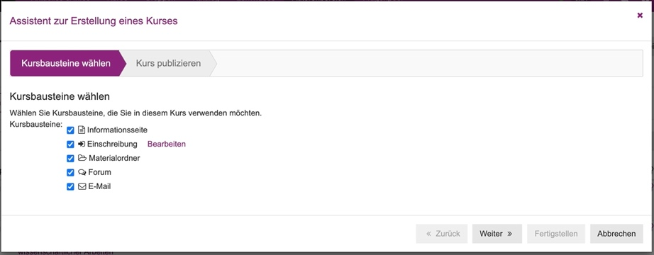

<!--

author: Moritz Riemann
email:  riemann@philsem.uni-kiel.de
version: 0.1
language: en
narrator: UK English Female

\-->

# Anleitung: Erstellen eines OLAT-Kurses mit Zugangsbeschränkungen

Diese Anleitung soll zeigen, wie Schritt für Schritt ein möglichst schlanker OLAT-Kurs ohne Redundanzen einzurichten ist. Dabei wird darauf geachtet, dass die Anzahl der Teilnehmenden begrenzt, das Nachrückverfahren geregelt und die hochgeladenen Inhalte vor dem Zugriff Dritter geschützt werden.

## Erstellen des Kurses

Im Tab "Autorenbereich" oben rechts auf den "Erstellen"-Button klicken & "Kurs" auswählen, dann "Herkömmlicher Kurs" und bei "Wizard" "Einfacher Kurs" auswählen (s. Bild 1 & 2).

*Bild 2: Durch die Wizard-Auswahl wird eine Vorauswahl an Kursbausteinen vorgeschlagen, die man je nach Bedarf teilweise oder ganz übernehmen kann. Später besteht sowohl die Möglichkeit, weitere Kursbausteine einzufügen, als auch an dieser Stelle ausgewählte wieder zu entfernen.*

### Auswahl der Kursbausteine

Aus den Vorschlägen des Wizards/des Assistenten diejenigen Kursbausteine wählen, die man möchte (später können ohne Weiteres Bausteine gelöscht & hinzugefügt werden) und auf "Weiter"

### Kurs publizieren 

Unter "Kurs publizieren" kann alles so gelassen werden, unten rechts auf "Fertigstellen" klicken.

### Einrichten der Startseite

Nun wird unter dem Reiter "Info" die spätere Startseite eingerichtet; Die Einträge, die hier gemacht werden, sind die, welche die Studierenden als Erstes sehen, wenn sie auf den Kurs klicken (s. Bild 5 & 6).

### Metadaten und Katalogzuordnung

Anschließend werden unter den Reitern "Metadaten" und "Durchführung" die entsprechenden Daten eingepflegt. Wichtig ist vor allem die **Katalogzuordnung** via "Fachbereiche/Katalog" unter "Metadaten" (s. Bild 7)! Hier kann "Philosophie" gesucht und angekreuzt werden, sodass der Kurs später im Katalog an der richtigen Stelle erscheint.
Unter "Metadaten" können außerdem die Durchführenden genannt und die didaktische Form ausgewählt werden, sodass Studierende direkt in der Veranstaltungsauswahl sehen können, von wem der Kurs ist und dass es sich um ein Seminar handelt.

Unter "Durchführung" kann das entsprechende Semester eingetragen werden, sodass Studierende den Kurs anhand des Filters **"aktuelle Kurse"** bei der Suche finden können. 

## Mitgliederverwaltung

Oben links auf "Administration", dann auf "Mitgliederverwaltung" klicken (s. Bild 8).

Links auf "Gruppen", rechts auf das Zahnradsymbol, um diejenigen Kategorien auszuwählen, die bei der Ansicht der Gruppe(n) angezeigt werden sollen.

*Bild 9: Die rechts ausgewählten Kategorien sind die Spaltentitel der Auflistung der Gruppe(n). Von links stehen hier: Name, Beschreibung, Teilnehmer, Plätze, Warteliste, etc. - eben alle, die rechts ausgewählt worden sind.*

Rechts auf "ändern" klicken. Nun können die soeben ausgewählten Kategorien entsprechend benannt werden (s. Bild 10 & 11).

*Bild 10: Die hier eingegebenen Textbausteine erscheinen...*

*Bild 11: ...hier als Spaltentitel der Übersicht.*

### Begrenzung der Teilnehmendenzahl und Warteliste

Ebenfalls unter "ändern" können die **Teilnehmendenzahl** begrenzt und die **Wartelistenmodalitäten** ausgewählt werden (s. Bild 12).

## Kursbausteine verwalten und Gewährleistung von Datenschutz

Über die Zurück-Buttons oben links kommt man wieder zur Ausgangsseite, wo nun unter "Administration" "Kurseditor" ausgewählt wird. Hier können Kursbausteine verändert, verschoben, gelöscht und hinzugefügt werden.

Häufig vorkommende Bausteine:

* Einschreibung
* Ordner
* Teilnehmerordner
* Forum
* E-Mail
* Teilnehmerliste
* Big Blue Button
* Wiki
* SCORM

[Hier](https://docs.openolat.org/de/manual_user/learningresources/Course_Elements/) geht es zu einer Übersicht & Erläuterung der unterschiedlichen Kursbausteine bei OLAT. Zur Implementierung von E-Learning-Ressourcen in einen OLAT-Kurs beachten Sie auch die "Anleitung Implementierung mit SCORM".

Man kann auch einzelne Bausteine mehrfach einfügen, bspw. einen zweiten Materialordner erstellen, um z.B. die Zugriffsberechtigung so zu gestalten, dass auch Studierende diesen Ordner zum Upload für Dateien nutzen können, die für alle sichtbar sein sollen.

### Zugriffbeschränkung für einzelne Kursbausteine

Um einzelne Kursbausteine, wie etwa "Materialordner" oder "Forum" **nur für eingeschriebene Gruppenteilnehmende zugänglich** zu machen, wählt man einen Kursbaustein aus, geht auf den Tab "Sichtbarkeit" und klickt "Gruppenabhängig" an und koppelt das an die entsprechende Gruppe (s. Bild 13). 

Alternativ kann man auch alles sichtbar lassen und über den Tab "Zugang" den Zugriff beschränken, aber das wäre umständlicher, da man dann wiederum Textblöcke erstellen muss, die unberechtigten Studierenden darlegen, warum sie etwas sehen, wozu sie keinen Zugriff haben etc.

Den Kursbaustein "Einschreibung" wiederum kann man sinnigerweise **zwar immer sichtbar, aber erst ab einem bestimmten Zeitpunkt zugänglich** machen, indem man unter dem Tab "Zugang" auf "Datumsabhängig" klickt und ein Datum eingibt. Unter dem Tab "Sichtbarkeit" wiederum kann man unten einen entsprechenden Hinweis platzieren, ab wann die Einschreibung möglich ist (s. Bild 14).

**Empfehlung**, wie man die Kursgestaltung insgesamt möglichst schlank hält, sodass sowohl der Erstellungsaufwand möglichst gering bleibt, als auch aus Studierendenperspektive **möglichst wenig Redundanzen und Orientierungsprobleme** entstehen:

Kursbaustein "Informationsseite" weglassen/löschen

Kursbaustein "Einschreibung" gleich als ersten
Link im Menü 

In der Liste der Kursbausteine auf der linken Seite den obersten Metabaustein (s. Bild 15) auswählen und bei "Titel im Kursmenü" einfach "Navigation" eintragen.

*Bild 15: Wenn man links den obersten Baustein auswählt, der zunächst den Titel des Kurses trägt, und selbigen in "Navigation" umbenennt...*

*Bild 16: ...steht anschließend links, über der Navigationsleiste, "Navigation".*

**Ergebnis:** 

Die Studierenden kommen so oder so auf die Start-/Infoseite, wenn sie den Kurs aus der Veranstaltungsauswahl heraus anklicken. Wenn sie dann auf "Kurs starten" klicken, gelangen sie nicht nochmal vor dieselben Informationen wie auf der Start-/Infoseite, sondern direkt zu den Einschreibungsmodalitäten. Schreiben sie sich in die Gruppe ein, erscheinen links die hinsichtlich der Sichtbarkeit eingeschränkten Kursbausteine.

### Kontakte bei Problemen 

[Anleitung auf der Homepage des OLAT-Projektes](https://docs.openolat.org/de/manual_user/learningresources/General_Information/) der frentix GmbH

[Seite des Rechenzentrums der CAU](https://www.rz.uni-kiel.de/de/angebote/e-learning/openolat)

